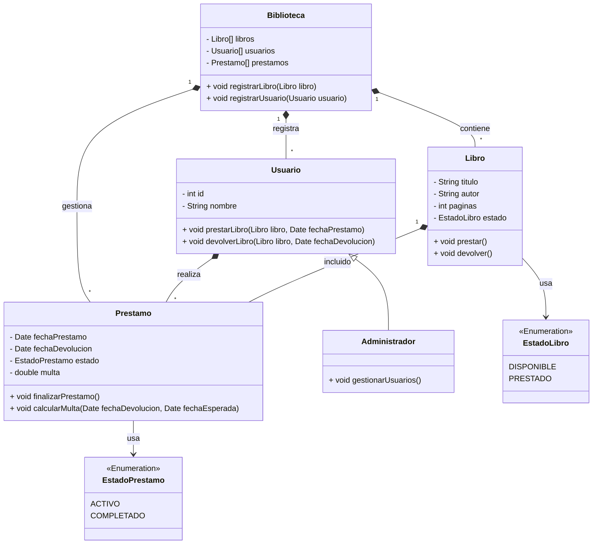

# Trabajo Práctico 1: Practica de UML :nerd_face:

## Sistema de Biblioteca

Se desea modelar un sistema simplificado para una biblioteca. La biblioteca tiene libros que pueden ser prestados a los usuarios registrados. Cada usuario puede prestar varios libros, pero un libro solo puede estar en posesión de un usuario a la vez. Si el libro no está prestado, está disponible para el próximo usuario.

### 1. Diagrama

### 2. Relaciones

- **Biblioteca y Libro (Composición):** Una Biblioteca contiene de 0 a muchos Libros. Si la Biblioteca desaparece, los Libros también desaparecen.
- **Biblioteca y Usuario (Composición):** Una Biblioteca registra de 0 a muchos Usuarios. Si la Biblioteca desaparece, los Usuarios también desaparecen.
- **Biblioteca y Préstamo (Composición):** Una Biblioteca gestiona de 0 a muchos Préstamos. Si la Biblioteca desaparece, los Prestamos también desaparecen.
- **Usuario y Préstamo (Composición):** Un Usuario realiza de 0 a muchos Préstamos. Si el Usuario desaparece, sus Préstamos también desaparecen.
- **Libro y Préstamo (Composición):** Un Libro está incluido en de 0 a muchos Préstamos. Si el Libro desaparece, sus Préstamos también desaparecen.
- **Usuario y Administrador (Herencia):** Un Administrador hereda de Usuario. Tiene capacidades adicionales para gestionar usuarios.

### 3. Aclaraciones

- Si el sistema de la Biblioteca se elimina por completo, se proceden a eliminar todos los datos asociados, incluidos los usuarios y libros para mantener la consistencia, esto para garantizar que no se conserven datos personales si el sistema ya no está en funcionamiento y/o evitar la persistencia de datos irrelevantes.
- Al eliminar la Biblioteca, eliminar los préstamos asociados evita datos huérfanos y mantiene el sistema limpio.
