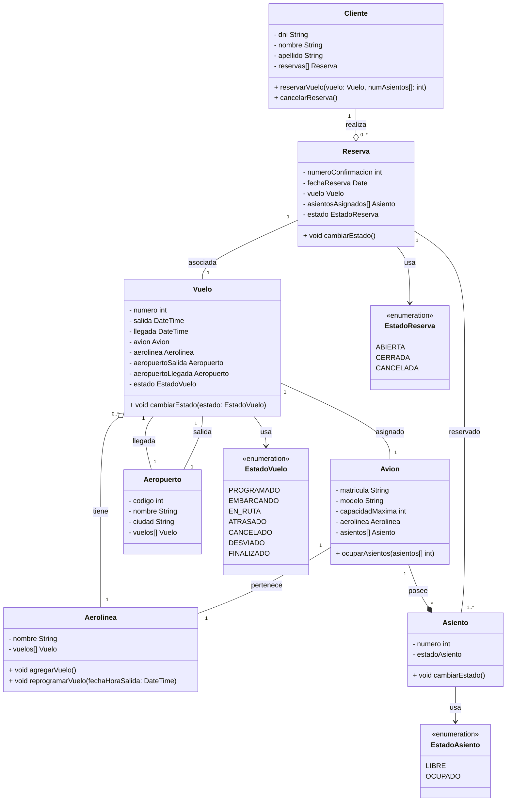

# Trabajo Práctico 1: Practica de UML :nerd_face:

## Sistema de Reservas de Vuelos

### 1. Diagrama

Se desea modelar un sistema de reservas de vuelos. El sistema permite a los clientes buscar y reservar vuelos, que conectan aeropuertos específicos en determinadas fechas y horas.

### 2. Relaciones

- **Vuelo y Avión (Relación Simple):** Un Vuelo está asignado a un único Avión. Si el Vuelo cambia, el Avión permanece, ya que puede estar asignado a otros vuelos en el futuro.
- **Vuelo y Aeropuerto (Relación Simple):** Un Vuelo tiene un Aeropuerto de salida único. Cada vuelo parte desde un aeropuerto, pero los vuelos pueden ser reprogramados, y el aeropuerto continúa existiendo independientemente del vuelo. Un Vuelo tiene un Aeropuerto de llegada único. Similar al aeropuerto de salida, cada vuelo tiene un destino en un aeropuerto, pero los aeropuertos pueden recibir muchos vuelos.
- **Aerolina y Vuelo (Relación de Agregación):** Una Aerolínea puede tener de 0 a muchos Vuelos asignados. Esta es una relación de agregación, ya que los vuelos pertenecen a la aerolínea, pero deben permanecer registrados incluso si una aerolínea desaparece o deja de operar.
- **Cliente y Reserva (Relación de Agregación):** Un Cliente puede realizar de 0 a muchas Reservas. Esta es una relación de agregación, ya que las reservas pueden continuar existiendo aunque un cliente deje de interactuar con el sistema, preservando información histórica.
- **Reserva y Vuelo (Relación de Simple):** Una Reserva está asociada a un único Vuelo.
- **Reserva y Asiento (Relación Simple):**  Una Reserva está asociada a uno o más Asientos. Cada reserva puede incluir varios asientos, pero si se elimina la reserva, esos asientos quedan liberados para otros clientes.
- **Avion y Aerolinea (Relación Simple):** Un Avión pertenece a una única Aerolínea. Esta relación implica que el avión es propiedad o está asignado exclusivamente a una aerolínea específica.
- **Avión y Asiento (Relación de Composición):** Un Avión posee múltiples Asientos. Esta es una relación de composición, ya que los asientos no tienen sentido sin el avión. Si el avión es eliminado, sus asientos también lo son.

Reserva --> EstadoReserva: usa

### 3. Aclaraciones

- Un vuelo puede tener los siguientes valores que reflejan las diferentes etapas o situaciones en las que puede estar:

  - **PROGRAMADO:** El vuelo ha sido creado y está confirmado para su salida en la fecha y hora programadas.
  - **EN_RUTA:** El vuelo ha despegado y se encuentra en trayecto hacia su destino.
  - **ATRASADO:** El vuelo ha sido retrasado por alguna razón, como condiciones climáticas o problemas operativos.
  - **CANCELADO:** El vuelo ha sido cancelado y no se realizará.
  - **DESVIADO:** El vuelo ha sido desviado a otro aeropuerto que no es su destino original por motivos de emergencia o logísticos.
  - **FINALIZADO:** El vuelo ha aterrizado en su destino final y ha concluido.
  - **EMBARCANDO:** El proceso de embarque de pasajeros está en curso.
  - **APLAZADO:** El vuelo ha sido reprogramado para una nueva fecha y/o hora.
