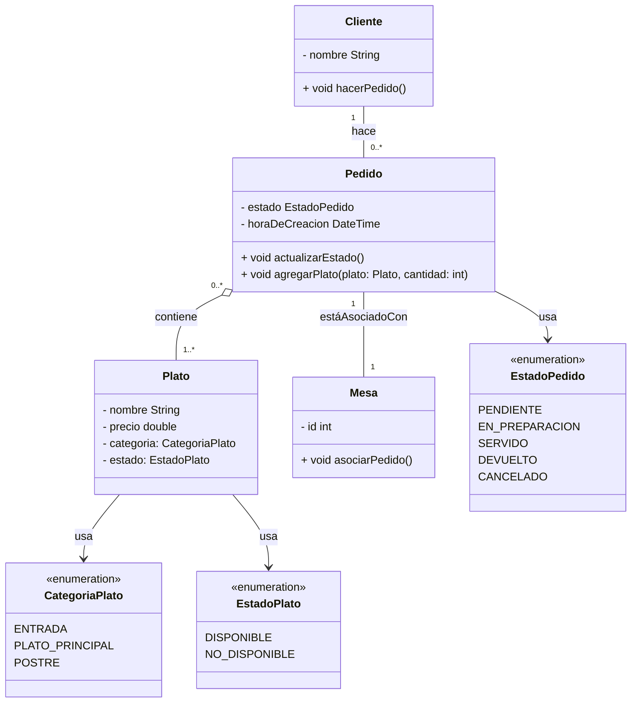

# Trabajo Práctico 1: Practica de UML :nerd_face:

## Sistema de Gestión de Pedidos de Restaurante

Se desea desarrollar un sistema para gestionar los pedidos de un restaurante. El sistema debe permitir registrar los pedidos que realizan los clientes, asociarlos a las mesas y hacer un seguimiento del estado de cada pedido.

### 1. Diagrama

### 2. Relaciones

- **Cliente y Pedido (Relación simple):** Un Cliente puede hacer de 0 a muchos Pedidos. Un Pedido es realizado por un único Cliente. Si un Cliente es eliminado, los Pedidos asociados seguirán existiendo.
- **Pedido y Mesa (Relación simple):** Un Pedido está asociado a una única Mesa. Una Mesa puede tener de 0 a muchos Pedidos. Si un Pedido es eliminado, la Mesa sigue existiendo, pero la relación entre el Pedido y la Mesa se pierde.
- **Pedido y Plato (Relación de Agregación):** Un Pedido puede contener de 0 a muchos Platos, y un Plato puede estar en de 0 a muchos Pedidos. La relación entre Pedido y Plato es muchos a muchos. Si un Plato es eliminado, el Pedido que lo contenía aún existe, pero el Plato ya no estará en el Pedido.

### 3. Aclaraciones

- El cliente realiza pedidos, pero el sistema gestiona la asignación de mesas. Pero, si el sistema requiere que el cliente pueda hacer pedidos desde una mesa específica, entonces podría ser posible una relación entre Cliente y Mesa. En tal caso, la relación sería:
  - Cliente `"1" -- "0..1"` Mesa: Un cliente puede estar asociado a una mesa específica (si el cliente hace un pedido en una mesa específica).
- Si un Plato se elimina, un Pedido que lo contiene puede volverse incompleto o inexacto, pero los pedidos que contenían platos eliminados pueden aún tener valor histórico o para la contabilidad. Por lo tanto, se decidió añadir un estado a los platos para manejar su disponibilidad sin eliminar los pedidos.
- Existe la posibilidad de que los pedidos puedan ser devueltos por varias razones, como insatisfacción del cliente, error en el pedido, o problemas con el servicio. Si un pedido es devuelto, puede ser necesario ajustar el inventario.
- A veces, un cliente puede cancelar un pedido después de haberlo realizado, antes de que se haya completado. Al poner un estado CANCELADO se permite registrar estas cancelaciones de manera clara.
